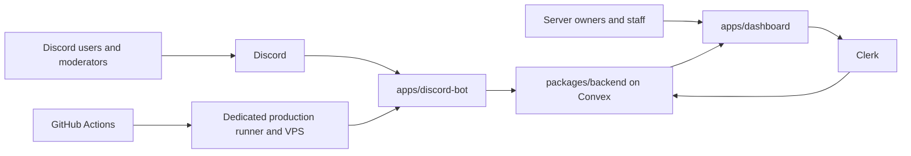

# Cleo

Cleo is a Discord-first community operations SaaS platform by JCoNet LTD. It combines a production Discord bot, a web dashboard, Convex-backed configuration, moderation and support tooling, operational visibility, and foundations for creator-platform automation.

Cleo v3 replaces the legacy collection of standalone services with one typed Bun and Turborepo monorepo. The current release prioritises a reliable Discord service and an honest, minimal dashboard instead of shipping disconnected settings, generic bot filler, or vanity features.

## Product links

- Website: [cleoai.cloud](https://cleoai.cloud)
- Dashboard beta: [beta.cleoai.cloud](https://beta.cleoai.cloud)
- Browsable coverage: [jcodog.github.io/Cleo](https://jcodog.github.io/Cleo/)
- Company: [JCoNet LTD](https://jconet.co.uk)

## Current product state

| Surface | State | Purpose |
| --- | --- | --- |
| Discord bot | v3.0.0 production | Guild lifecycle, welcome messages, moderation, support, logging, runtime incidents, and focused utility commands |
| Dashboard | Public beta | Discord installation, guild configuration, audit visibility, support routing, and staff operations |
| Cleo Profiles and Pets | Foundation in development | Account identity, pet progression, public cards, battles, and future Discord widget surfaces |
| Twitch bot | Planned migration | Creator chat automation, linked accounts, and EventSub lifecycle |
| Kick bot | Planned migration | OAuth, webhooks, creator chat automation, and linked accounts |
| Real-time relay | Planned migration | Typed live events, overlays, and cross-platform delivery |

The v3.1 workstream adds product-connected Discord features that were deliberately left out of the stability-first v3.0.0 release. It does not restore legacy CoD Stats, Prisma premium tables, the old free-AI quota system, or generic commands that do not justify permanent command-surface space.

## What Cleo does today

### Discord community operations

- Synchronises guild install, join, leave, reconnect, and shard-aware READY state with Convex.
- Loads validated guild runtime configuration through a cache-backed bot service.
- Sends configured welcome messages and rendered welcome cards.
- Provides safe `/ban` and `/kick` moderation actions with permission and hierarchy checks.
- Records moderation outcomes for dashboard visibility.
- Captures selected live guild events and mirrors configured logs without storing deleted message content.
- Routes `/help` into private Cleo support or guild modmail flows.
- Reports actionable runtime incidents without treating normal user mistakes as production alerts.

### Dashboard and backend

- Uses Clerk for authenticated account access and Discord as the primary identity.
- Uses Convex as the source of truth for configuration, operational state, support, moderation, and product foundations.
- Provides a focused Discord workspace for Overview, Welcome, Moderation, Support, Logs, and Settings.
- Uses shared schemas and packages so dashboard and bot behaviour do not drift.

### Engineering and operations

- Uses targeted TypeScript, ESLint, test, coverage, build, packaging, and deployment checks.
- Publishes browsable coverage from successful `main` regression runs.
- Packages exact-SHA Discord releases and activates them through a dedicated production runner.
- Keeps production environment files outside repository checkouts.
- Supports controlled restart and rollback through the documented VPS deployment contract.

## Architecture



## Repository map

### Apps

- `apps/dashboard` contains the authenticated Next.js dashboard and public product surfaces.
- `apps/discord-bot` contains the Discord runtime, command registry, gateway events, services, and production scripts.
- `apps/twitch-bot`, `apps/kick-bot`, `apps/ws-relay`, and `apps/web` are planned workspaces and must not be represented as shipped until they exist and are validated.

### Shared packages

- `packages/backend` contains the Convex schema, functions, validators, and protected bot and dashboard operations.
- `packages/env` contains typed server and client-safe environment entry points.
- `packages/logger` contains structured logging, error serialisation, and redaction helpers.
- `packages/shared` contains app-safe contracts, constants, schemas, entitlements, and Cleo Profile and Pet models.
- `packages/ui` contains shared shadcn/ui primitives and Cleo design-system components.
- `packages/eslint-config` and `packages/typescript-config` contain shared engineering configuration.

## Product boundary

CoD Stats and ranked-stat tracking are separate JCoNet products and are not part of Cleo.

Do not add ranked sessions, game logging, BO6 or BO7 analytics, stat cards, stats dashboards, stats commands, stats AI tools, or stats migration code to this repository.

Do not reintroduce Prisma or duplicate backend APIs. New product state belongs in Convex and shared contracts.

## Local development

### Requirements

- Node.js version from `.nvmrc` and the root `engines` field
- The Bun version declared by the root `packageManager` field

### Install

```bash
bun install
```

### Run development tasks

```bash
bun run dev
```

### Targeted validation

Run checks only for the workspaces affected by a change:

```bash
bun run --filter @workspace/discord-bot test
bun run --filter @workspace/discord-bot typecheck
bun run --filter @workspace/discord-bot lint

bun run --filter @workspace/backend test
bun run --filter @workspace/backend typecheck
bun run --filter @workspace/backend codegen

bun run --filter @workspace/dashboard test
bun run --filter @workspace/dashboard typecheck
bun run --filter @workspace/dashboard lint
```

Use `bun run test:coverage` only when the affected scope needs the full regression and coverage path.

### Discord command registration

```bash
bun run --filter @workspace/discord-bot commands:register:guild
bun run --filter @workspace/discord-bot commands:register:global
```

Global command replacement uses Discord's bulk overwrite endpoint and must remain non-destructive.

## Configuration and deployment

- Copy only the relevant example environment file for the workspace being run.
- Never commit credentials, production environment values, user content, or generated secret files.
- Discord production setup, ownership, packaging, activation, command registration, restart, and rollback are documented in [`docs/discord-production-deployment.md`](docs/discord-production-deployment.md).
- Product decisions and migration boundaries are documented under `docs/product`.

## Roadmap

The active Cleo project is tracked in Linear. The main post-v3.0 Discord tracks are:

- v3.0.1 production artifact and readiness hardening
- v3.1 guild-manager `/cleo status` control-plane visibility
- Cleo Profiles, Pets, battles, cards, and widget adapters
- A redesigned entitlement-backed AI assistant
- Discord-native purchase and entitlement synchronisation
- Expanded high-value audit event coverage
- Twitch, Kick, and real-time relay migrations

A feature appearing in an old repository does not automatically make it part of the current product. Legacy ideas are reviewed and explicitly marked as rebuild, defer, replace, or reject before implementation.

## Contributing

Read [`CONTRIBUTING.md`](CONTRIBUTING.md) and [`AGENTS.md`](AGENTS.md) before making changes.

High-quality contributions should:

- stay inside the documented product boundary;
- reference a Linear or GitHub issue;
- keep changes focused and reviewable;
- add meaningful behavioural tests rather than assertion-free test files;
- run targeted validation for every affected workspace;
- disclose material use of coding agents in the pull request when it helps reviewers understand the change;
- avoid generated churn, unrelated formatting, fake data, and speculative abstractions.

## Security

Report vulnerabilities privately. See [`SECURITY.md`](SECURITY.md) for supported versions, reporting routes, and disclosure expectations.

Do not open a public issue containing exploit details, credentials, personal data, private messages, or production configuration.

## Source and licence

This repository is publicly visible, but it is currently proprietary software under the included [`LICENSE`](LICENSE). It is not presently licensed as open source and must not be described as OSI-approved open-source software.

JCoNet LTD is reviewing which code can be released under an open-source licence while keeping hosted infrastructure, secrets, user data, brand assets, and commercial service operations protected. Until the licence changes, copying, modification, distribution, sublicensing, and use require prior written permission.

Copyright © 2026 JCoNet LTD. All rights reserved.
