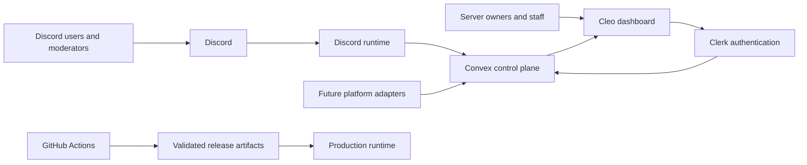

<div align="center">

# Cleo

**Open source, Discord-first community operations and automation platform.**

Cleo brings moderation, support, configuration, operational visibility and community tooling into one typed platform, with Discord as the first production integration and a path toward broader creator and workplace communication surfaces.

[Website](https://cleoai.cloud) · [Dashboard](https://beta.cleoai.cloud) · [Coverage](https://jcodog.github.io/Cleo/) · [Contributing](CONTRIBUTING.md) · [Security](SECURITY.md)

[](https://github.com/jcodog/Cleo/actions/workflows/regression.yml)
[](LICENSE)

</div>

## What is Cleo?

Cleo is a community operations platform built by [JCoNet LTD](https://jconet.co.uk).

It started with Discord, where Cleo already provides a production bot, web dashboard and shared backend for server configuration, moderation, support, logging and operational state. The long-term goal is broader than a single bot or platform: one control plane with platform-specific runtimes for the places communities, creators, teams and customers already communicate.

**Cleo is Discord-first, not Discord-only.**

The repository is designed around shared contracts and platform adapters so future Discord, Twitch, Kick, realtime, workplace and web surfaces can reuse the same underlying product model without becoming disconnected services.

## Current reach

Discord currently reports:

- **44 server installs**
- **352 individual user installs**

These figures are from the Discord Developer Portal as of 29 August 2026. They are install counts, not monthly active-user figures.

Cleo reached this point without paid advertising or promotion through major Discord bot directories. Public distribution and discovery are still early.

## What works today

| Surface | Status | Purpose |
| --- | --- | --- |
| Discord runtime | Production | Guild lifecycle, moderation, welcome flows, support, logging, runtime incidents and focused utility commands |
| Cleo dashboard | Public beta | Installation, guild configuration, audit visibility, support routing and staff operations |
| Convex control plane | Production foundation | Configuration, operational state, moderation, support, identity and product data |
| Cleo Profiles and Pets | In development | Account identity, progression, public cards, battles and future Discord-native surfaces |
| Twitch integration | Planned migration | Creator chat automation, linked accounts and EventSub lifecycle |
| Kick integration | Planned migration | OAuth, webhooks, creator chat automation and linked accounts |
| Realtime relay | Planned migration | Typed live events, overlays and cross-platform delivery |
| Cleo Work | Long-term direction | Workplace and customer communication surfaces such as Teams, Slack and website live chat |

Planned features are deliberately labelled as planned. A feature being present in a legacy Cleo repository does not mean it is shipped or supported in the current product.

## Discord community operations

The production Discord runtime currently includes:

- Guild install, join, leave, reconnect and shard-aware READY lifecycle synchronisation
- Validated, cache-backed guild runtime configuration
- Configurable welcome messages and rendered welcome cards
- Permission-aware moderation actions
- Moderation outcome recording for dashboard visibility
- Selected guild event logging with privacy-conscious handling of deleted content
- Private Cleo support and guild modmail flows
- Runtime incident reporting that distinguishes production failures from normal user mistakes
- Dashboard-connected guild status and setup visibility

## Dashboard and backend

Cleo uses a shared backend and contracts so the web dashboard and platform runtimes do not drift apart.

Current foundations include:

- Clerk authentication with Discord as the primary identity
- Convex as the source of truth for backend data and business logic
- Discord guild installation and lifecycle state
- Guild configuration and membership data
- Moderation records and audit events
- Support configuration, tickets and ticket messages
- Runtime error and incident state
- Cleo Profiles and Pets data models
- Shared validation and TypeScript contracts across applications

## Architecture



The architectural direction is a shared Cleo control plane with independent platform runtimes at the edges.

## Repository layout

### Applications

- `apps/dashboard` contains the authenticated Next.js dashboard and public product surfaces.
- `apps/discord-bot` contains the Discord gateway runtime, commands, events, services and production tooling.
- Future Twitch, Kick, realtime and other platform runtimes are added as dedicated workspaces when they are ready to be rebuilt and validated.

### Shared packages

- `packages/backend` contains the Convex schema, queries, mutations, actions and protected operations.
- `packages/env` contains typed environment entry points.
- `packages/logger` contains structured logging, error serialisation and redaction helpers.
- `packages/shared` contains shared contracts, constants, schemas, entitlements and product models.
- `packages/ui` contains shared UI primitives and Cleo design-system components.
- `packages/typescript-config` contains shared TypeScript configuration.

## Engineering principles

Cleo is maintained as production software rather than a collection of disconnected bot commands.

The repository prioritises:

- Strict TypeScript contracts
- Shared schemas instead of duplicated application logic
- Behavioural tests around important runtime paths
- Zero-warning linting
- Automated typechecking and coverage
- Exact-SHA production release artifacts
- Deployment validation and rollback
- Secret and environment separation
- Explicit product boundaries
- Honest distinction between shipped and planned functionality

The main regression workflow validates TypeScript, linting, tests, coverage, production operations scripts and Discord release packaging before publishing browsable coverage.

## Technology

Cleo currently uses:

- TypeScript
- Bun
- Turborepo
- Next.js
- React
- Discord.js
- Convex
- Clerk
- Tailwind CSS
- GitHub Actions

Production runtime services are deployed separately from the web frontend so persistent gateway and worker processes are not coupled to serverless web hosting.

## Local development

### Requirements

Use the Node.js version declared in `.nvmrc` and the Bun version declared in the root `package.json`.

### Install dependencies

```bash
bun install
```

### Start development

```bash
bun run dev
```

### Validate the workspace

```bash
bun run typecheck
bun run lint
bun run test
```

For full regression coverage:

```bash
bun run test:coverage
```

Workspace-specific scripts are available in each package when you only need to validate an affected surface.

## Deployment

Cleo's Discord runtime is packaged as an exact-commit production artifact and activated through a dedicated deployment contract.

Production environment files stay outside repository checkouts. Release packaging, host bootstrap, validation, activation, restart and rollback are documented in [`docs/discord-production-deployment.md`](docs/discord-production-deployment.md).

Do not commit production credentials, user content, environment secrets or generated secret material.

## Product direction

The immediate focus is making the Discord product reliable, useful and commercially sustainable before expanding the number of supported platforms.

Current priorities include:

1. Production reliability and release hardening
2. Higher-value Discord community operations
3. Cleo Profiles, Pets and Discord-native product surfaces
4. Entitlement-backed premium features
5. A redesigned AI assistant with clear product value and usage controls
6. Broader audit and operational visibility
7. Twitch, Kick and realtime platform migrations
8. A reusable platform-adapter model for future communication surfaces

### Cleo Work

Cleo Work is a longer-term product direction for teams and businesses.

The goal is to reuse Cleo's shared control plane, automation, identity and operational foundations across workplace and customer communication surfaces such as Microsoft Teams, Slack and website live chat.

Cleo Work is not currently a shipped product and should not be represented as one.

## Product boundary

Game-stat tracking is not part of Cleo.

CoD Stats and ranked-stat tracking are maintained as a separate JCoNet product. Do not add ranked sessions, BO6 or BO7 analytics, stat cards, game-stat dashboards, stat commands or related migration code to this repository.

New Cleo product state belongs in Convex and shared contracts. Do not reintroduce Prisma or duplicate backend APIs.

## Contributing

Contributions are welcome.

Please read [`CONTRIBUTING.md`](CONTRIBUTING.md), [`AGENTS.md`](AGENTS.md) and the repository's product documentation before making a change.

Good contributions should:

- Stay inside the documented product boundary
- Reference a relevant issue where practical
- Keep related implementation work focused and reviewable
- Add meaningful behavioural tests for changed behaviour
- Run validation for affected workspaces
- Avoid unrelated formatting churn and speculative abstractions
- Clearly distinguish generated or agent-assisted work when that context helps reviewers

## Security

Please report security vulnerabilities privately rather than opening a public issue containing exploit details, credentials, personal data, private messages or production configuration.

See [`SECURITY.md`](SECURITY.md) for supported versions and reporting guidance.

## License

Cleo is open source under the **GNU Affero General Public License v3.0 only (`AGPL-3.0-only`)**.

You may use, study, modify, self-host and redistribute Cleo subject to the terms of the AGPL. If you modify the AGPL-covered software and make that modified version available for users to interact with over a network, the licence includes source-availability obligations described in the full licence text.

Copyright © 2026 JCoNet LTD. JCoNet LTD retains its copyright ownership. The AGPL grants permissions under copyright; it does not grant rights to Cleo or JCoNet LTD trademarks, names, logos or other brand identifiers.

JCoNet LTD may separately offer commercial licensing where appropriate.

See [`LICENSE`](LICENSE) for the complete licence terms.

## Project links

- Website: [cleoai.cloud](https://cleoai.cloud)
- Dashboard: [beta.cleoai.cloud](https://beta.cleoai.cloud)
- Coverage: [jcodog.github.io/Cleo](https://jcodog.github.io/Cleo/)
- Company: [JCoNet LTD](https://jconet.co.uk)

Cleo is developed and maintained by JCoNet LTD.
