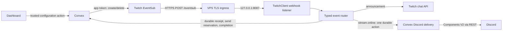

# Twitch event architecture

Convex owns subscription lifecycle. The always-running Twitch bot owns webhook reception and local chat actions. Feature configuration changes create or delete subscriptions immediately; neither bot polls for desired subscriptions.

## Ownership and identity

The customer's broadcaster is a Clerk-verified secondary linked account; Discord remains primary. The dedicated bot is infrastructure, never a customer linked account. Clerk, Convex and the runtime must use the same Twitch Client ID. Enabling validates fresh Clerk evidence, Twitch token identity, client ID and required scopes before any enabled configuration is persisted. No credentials enter client queries.

`packages/shared/src/twitchEventSub.ts` defines all event keys, types, versions, conditions, scopes, schemas, handler identities and announcement templates. Convex lifecycle actions, dashboard tag lists/previews, scope resolution and webhook routing use that registry.

Subscriptions have one identity: broadcaster + type + version + sorted condition + callback. Consumer membership changes and desired configuration are transactional. Guild consumers use `guild:<id>`; announcement consumers use `announcement:<user>:<event>`. Removing one consumer retains a subscription while others remain. Removing the last immediately requests deletion. Provider failures preserve useful IDs and reactive failure state for authorized retry, including failed deletions after disable.

Each external operation takes a transactional lease. Concurrent changes increment a revision and schedule a follow-up for that specific changed subscription. A one-shot lease recovery handles an interrupted operation. These are operation recovery, not recurring desired-state synchronization. Revocation updates state; the VPS never recreates a subscription.

## Runtime and webhook security

`TwitchClient` coordinates the private bot grant, token lifecycle, API service, webhook listener, typed router, chat sender and readiness. Its 30-second loop maintains bot tokens and local process/listener readiness only. It performs zero desired-subscription polling and contains no subscription create/delete client.

The callback is `https://<operator-managed-twitch-host>/eventsub`. The bot binds `127.0.0.1:8087` by default behind HTTPS ingress. Read-only inspection of PuTTY profile `oracle` found no ingress installed, host contract 2 and port 8087 available. Host contract 3 supplies a complete Nginx TLS virtual-host example for the later rollout; bootstrap does not install or activate Nginx, DNS or TLS. The operator must choose the hostname and certificate and permit HTTPS through Oracle and host firewall rules. Only POST `/eventsub` is public; GET `/healthz` is local and all other public paths return 404.

Webhook verification uses the raw body, message ID and original timestamp for HMAC-SHA256, timing-safe comparison, a 64 KiB bound, ten-minute age bound and one-minute future allowance. Payloads are parsed by their registered schema and broadcaster condition. Valid challenges return their exact text immediately. Notifications are acknowledged after one bounded persistence request and before chat side effects. Duplicate message IDs persist for 24 hours, comfortably beyond the accepted replay window. At most 256 asynchronous handler/status tasks are admitted; shutdown drains them.

| Handler                                                                                                      | VPS-to-Convex work                                                                                                                                                                                                    |
| ------------------------------------------------------------------------------------------------------------ | --------------------------------------------------------------------------------------------------------------------------------------------------------------------------------------------------------------------- |
| follow, subscribe, resubscribe, subscriptionGift, cheer, raid, hypeTrainBegin, hypeTrainEnd, charityDonation | `reserveEvent` persists a resumable event and returns its template; `beginDispatch` validates current authority/config before the send reservation; `finishDispatch` records sent/uncertain. Render and send locally. |
| chatMessage                                                                                                  | Non-announcement receipt is ignored centrally; handler never echoes viewer messages.                                                                                                                                  |
| streamOnline                                                                                                 | One `receiveOnline` action persists message/session dedupe and schedules Discord fan-out. No separate receipt request.                                                                                                |
| Challenge                                                                                                    | One asynchronous subscription-state action, independent of challenge response.                                                                                                                                        |
| Revocation                                                                                                   | One subscription-state action; no automatic VPS resubscribe.                                                                                                                                                          |

Chat receipts have durable pending, sending, sent, uncertain and ignored states. A lost reserve response can resume pending work on redelivery or once during startup recovery, paginated at 50 receipts. Preparation failures receive at most two event-driven retries before deferral to durable recovery. Before send reservation, central checks require an enabled supported config, matching broadcaster, active user, fresh Clerk/Twitch scopes and unchanged linked-account evidence. Disabled/stale deliveries are acknowledged without dispatch. Once a POST could have executed, no automatic replay is permitted. Logs omit persistent broadcaster IDs, tokens and viewer text. Shutdown aborts API/backend requests and drains accepted work. Discord uses its own durable delivery reservation and uncertain state described in [live notifications](live-notifications.md).

Verification challenges remain immediate. Convex schedules up to three confirmation attempts for that specific newly created Connecting subscription, repairing a lost status write or reporting Provider unavailable. This bounded operation repair never runs as recurring desired-state polling.

## Templates and permissions

See [the full event, tag and default-template contract](announcements.md). Source templates are at most 400 Unicode code points, with plain strict tag replacement. Final chat output is bounded to Twitch's 500-character limit; oversized custom expansion falls back to the Cleo default. An oversized default fails closed. Control characters, line breaks, bidi controls and invalid surrogates normalize to spaces. Outbound text is never executed as code or fed into Cleo command parsing.

`resolveBroadcasterScopes` always includes `channel:bot`, then deduplicates feature scopes. Clerk `reauthorize()` requests the base, union of desired missing features and already granted scopes, followed by trusted evidence synchronization. Each announcement displays required permissions before enable; revoked subscriptions show Reconnect required. Saved revisions protect dirty templates from lagging query data. Live settings verify current owner and Discord destination permissions through a focused action, while subscription status remains reactive. Provider/selector retries appear only for actual failures.

The bot's separate grant requires `user:read:chat`, `user:write:chat`, `user:bot`. Chat delivery obtains the validated bot User Access Token through `TwitchAuthService.botToken()` and the existing locked GrantStore rotation/recovery machinery. App tokens remain separate for app-only Helix operations, with coalesced acquisition. Twitch forbids `for_source_only` with a User Access Token, so chat requests omit it. In an active shared-chat session, Twitch propagates user-token messages to every participating channel; this provider behavior cannot be restricted in user-token mode. Bot refresh credentials remain in the private grant file outside immutable releases; app tokens remain in memory. Sensitive Twitch environment variables are scoped to backend/runtime tasks, not root Turbo globalEnv.

## Workflow diagnostics

`CLEO_TWITCH_DEPLOY_ENABLED` is configured in the GitHub `twitch-production` environment. Its former job-level use could evaluate before environment variables existed. A protected validation job now reads it in a step and publishes a boolean output consumed by the backend/activation jobs. Missing or non-true values fail closed. Trusted-main automatic deployment and the protected environment remain intact.

`secrets.CONVEX_DEPLOY_KEY` remains a valid protected step-level context reference. VS Code cannot discover private environment secret names; an editor diagnostic about that name is not a reason to move it into a repository variable or remove environment protection. Workflow validation is recorded in the implementation report. No workflow was dispatched or production deployed during this task.

## Primary references

- [Twitch EventSub subscription types](https://dev.twitch.tv/docs/eventsub/eventsub-subscription-types/)
- [Twitch webhook verification and responses](https://dev.twitch.tv/docs/eventsub/handling-webhook-events/)
- [Twitch event payload reference](https://dev.twitch.tv/docs/eventsub/eventsub-reference/)
- [Twitch Send Chat Message](https://dev.twitch.tv/docs/api/reference/#send-chat-message)
- [Clerk external-account reauthorization](https://clerk.com/docs/reference/types/external-account)
- [GitHub contexts and environment variables](https://docs.github.com/en/actions/reference/workflows-and-actions/contexts)

The local old Cleo-Kick receiver and old dashboard Kick router informed the control-plane/runtime split. CoD-Stats-Tracker informed service naming only; its subscription sync timer was not copied. Stats tracking remains outside Cleo. Generic provider unlink reconciliation remains JCN-213 work; fresh authorization checks protect configuration and Discord delivery.
