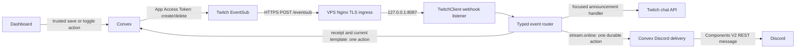

# JCN-226 implementation report

Branch: `feat/jcn-226-twitch-event-architecture`, based on latest fetched `main` at `4c5918b4c6917f4a3ab9f4ea4e161fae8c213efd`.

PR: [jcodog/Cleo #234](https://github.com/jcodog/Cleo/pull/234). Implementation commit: `a398dd1c5f3e0a7e598f483cdc16417f437182b9`, signed and verified locally and by GitHub. The user's signed `1614c2fe578c803c1bc965e6e7c945d5cce23a36` dependency commit also includes the inspected-host ingress correction. The report commit is recorded in PR history. No production deployment, service restart or configuration mutation was performed.

## 1. Architecture



The old Cleo-Kick webhook receiver and old dashboard Kick subscribe/unsubscribe router informed the split. CoD-Stats-Tracker informed service organization only. Its subscription sync timer was excluded. No stats features were imported.

## 2. Final Twitch source tree

The registry and schemas live in `packages/shared/src/twitchEventSub.ts` so the backend, dashboard and runtime use one definition. The complete source tree includes colocated tests.

```text
apps/twitch-bot/src/
  auth/
    authorization.test.ts
    authorization.ts
    grantStore.platform.test.ts
    grantStore.recovery.test.ts
    grantStore.test.ts
    grantStore.ts
    privateFile.ts
  classes/
    TwitchClient.test.ts
    TwitchClient.ts
  deployment/
    artifactTypes.test.ts
    validateArtifact.d.mts
    validateArtifact.mjs
    validateArtifact.test.ts
  handlers/eventsub/
    charityDonation.ts
    chatMessage.ts
    cheer.ts
    follow.ts
    hypeTrainBegin.ts
    hypeTrainEnd.ts
    raid.ts
    resubscribe.ts
    streamOnline.ts
    subscribe.ts
    subscriptionGift.ts
  runtime/
    readiness.test.ts
    readiness.ts
  scripts/
    authorizeBot.ts
    checkReadiness.ts
    scripts.test.ts
    sendSmokeMessage.ts
  services/
    ConvexService.test.ts
    ConvexService.ts
    TwitchApiService.test.ts
    TwitchApiService.ts
    TwitchAuthService.test.ts
    TwitchAuthService.ts
    announcements/
      AnnouncementService.ts
    eventsub/
      EventSubRouter.test.ts
      EventSubRouter.ts
      TwitchWebhookServer.test.ts
      TwitchWebhookServer.ts
  index.ts
```

## 3. TwitchClient responsibilities

Owns the dedicated bot grant, token lifecycle, API service, listener, typed router, local chat sending, readiness and orderly shutdown. Startup/shutdown remain explicit methods, with a tiny entrypoint and no side-effect imports. The 30-second local maintenance timer validates/refreshes bot authorization and readiness only. It does not query configuration or create/delete subscriptions.

## 4. Callback and actual host inspection

Callback contract: `https://<operator-chosen-twitch-host>/eventsub`, HTTPS port 443, exact path. Internal listener: `127.0.0.1:8087` by default. Public POST `/eventsub` only; health stays local and other public paths return 404.

Read-only PuTTY `oracle` inspection found the existing Twitch service active, host contract 2, no Nginx/Caddy/Apache/other ingress service installed and port 8087 unused. The implementation therefore includes a complete Nginx TLS virtual-host example, rather than assuming an existing HTTPS server. The actual DNS hostname and certificate are not configured by this task. No production endpoint is claimed to exist yet.

## 5. Enabling

The authenticated Convex action verifies current Clerk-linked broadcaster evidence, Twitch application identity and required scopes. Invalid drafts or missing permission are rejected before enabled configuration is written. One transaction saves the visible configuration/template and enabled state, acquires consumer membership and creates/updates the logical subscription row. The action immediately acquires an App Access Token, finds/adopts an exact matching external subscription or creates it, and stores its ID/status. The webhook challenge updates reactive status to Ready. No separate Save, restart or manual refresh is needed.

## 6. Disabling

One transaction saves disabled state and releases this consumer, preserving the custom template. The action immediately deletes the external subscription only if no consumers remain. Successful deletion clears its external ID; failed deletion retains the ID and error state for an authorized Retry subscription operation. Disabling one of several consumers keeps the external subscription.

## 7. Shared ownership and concurrent changes

Identity is broadcaster + Twitch type + version + sorted condition + callback. `twitchEventConsumers` stores membership; guild consumers use `guild:<id>` and announcement consumers use `announcement:<user>:<event>`. Multiple guilds share one `stream.online` subscription. Transactions, revisions and external-operation leases serialize competing changes. Recovery is one-shot for an interrupted operation, scoped to that subscription. There is no recurring desired-state reconciliation.

## 8. Polling removal

The VPS performs **zero desired-subscription polling**. Old runtime source polling, five-minute reconciliation, Convex webhook routes and desired-source tables were removed. The Discord Gateway live-notification polling worker and pending/claim client path were removed. `TWITCH_RUNTIME_CONVEX_SECRET` is obsolete. `TWITCH_WORKER_SECRET` has one purpose: authenticate verified VPS event/persistence calls.

## 9. Runtime Convex calls

| Event                                                                            | Calls and purpose                                                                                                                                                                                                      |
| -------------------------------------------------------------------------------- | ---------------------------------------------------------------------------------------------------------------------------------------------------------------------------------------------------------------------- |
| Follow, subscribe, resubscribe, gift, cheer, raid, Hype Train begin/end, charity | `reserveEvent` stores a resumable payload and returns its template; `beginDispatch` centrally verifies current config/authority before send reservation; `finishDispatch` records sent/uncertain. Render/send locally. |
| Chat message                                                                     | Non-announcement receipt is ignored centrally; no viewer-message echo.                                                                                                                                                 |
| Stream online                                                                    | One `receiveOnline` action reserves message/session evidence and durably schedules backend fan-out. No separate receipt call or VPS guild fan-out.                                                                     |
| Challenge                                                                        | One asynchronous subscription-status call; response does not wait on it.                                                                                                                                               |
| Revocation                                                                       | One focused subscription-status action. VPS never resubscribes.                                                                                                                                                        |

## 10. Discord card and delivery

Convex resolves authorized enabled guild destinations, enriches Get Streams metadata once and Get Users profile data once for the event, then schedules durable REST deliveries using the production Discord bot token. The card uses a Twitch-purple Container, Section with optional avatar Thumbnail, title/category/name/login, 640×360 Media Gallery stream preview, relative started time, optional viewer count, Separator and Watch on Twitch link button, with `IsComponentsV2`. Missing optional metadata degrades cleanly. No legacy embeds.

Strict allowed mentions, text sanitization, destination permissions and fresh owner/config authority remain enforced. Retries are limited to pre-reservation work. After send reservation there is one POST; ambiguous outcomes become uncertain and are never blindly resent. Persistent message/session and delivery evidence prevent duplicates.

## 11. Dashboard behavior

Guild live settings keep ordinary destination/mention/role edits in a local draft. Save is disabled when clean or invalid, enabled only for valid changes, and becomes clean after success. Ordinary configuration saves do not mutate `stream.online`. Enable immediately saves a valid visible draft with enabled=true and ensures the subscription. Invalid enable writes nothing. Disable immediately releases its consumer. Reactive status shows Disabled, Connecting, Ready, Missing permission, Subscription failed or Provider unavailable. The normal Refresh connection button is gone; Retry subscription appears only for failure.

`/twitch` has nine independent announcement toggles grouped as Community, Subscriptions and Support. Each row has default/custom text, a 400-character counter, supported clickable tags, fake-data live preview, Reset to default and dirty-aware Save. Template-only saves never mutate EventSub. Enable saves a dirty template and enabled=true together. Disable preserves custom text. A missing override uses the central default; reset or identical default text clears the override.

## 12. Exact EventSubs, tags and defaults

| Announcement         | EventSub                             | Supported tags                                               | Cleo default                                                              |
| -------------------- | ------------------------------------ | ------------------------------------------------------------ | ------------------------------------------------------------------------- |
| New follow           | `channel.follow` v2                  | `{user}`, `{channel}`                                        | Thanks for the follow, {user}! 💜                                         |
| New subscriber       | `channel.subscribe` v1               | `{user}`, `{channel}`, `{tier}`                              | Thanks for subscribing, {user}! 💜                                        |
| Resubscription       | `channel.subscription.message` v1    | `{user}`, `{channel}`, `{tier}`, `{months}`                  | {user} just resubscribed for {months} months! 💜                          |
| Gifted subscriptions | `channel.subscription.gift` v1       | `{user}`, `{channel}`, `{tier}`, `{count}`, `{total}`        | {user} gifted {count} subs! That's {total} gifted in total! 💜            |
| Bits cheered         | `channel.cheer` v1                   | `{user}`, `{channel}`, `{bits}`                              | Thanks {user} for cheering {bits} Bits! 💜                                |
| Incoming raid        | `channel.raid` v1                    | `{user}`, `{channel}`, `{viewers}`                           | Welcome raiders! {user} raided with {viewers} viewers! 💜                 |
| Hype Train started   | `channel.hype_train.begin` v2        | `{channel}`, `{level}`, `{total}`                            | 🚂 Hype Train started! Let's go!                                          |
| Hype Train ended     | `channel.hype_train.end` v2          | `{channel}`, `{level}`, `{total}`                            | 🚂 Hype Train ended at level {level} with {total} contribution points! 💜 |
| Charity donation     | `channel.charity_campaign.donate` v1 | `{user}`, `{channel}`, `{amount}`, `{currency}`, `{charity}` | {user} donated {amount} to {charity}! 💜                                  |

Also registered: `stream.online` v1 and `channel.chat.message` v1, without announcement templates. Raid conditions use `to_broadcaster_user_id`; follow conditions use the authorized broadcaster as moderator. No Host event, `channel.bits.use` or Hype Train progress spam.

Anonymous gifts/Bits resolve `{user}` to `An anonymous viewer`. Missing gift cumulative total omits the built-in default's total sentence; a custom `{total}` receives `not available`, never an invented number. Gifted recipients in `channel.subscribe` are suppressed. `{months}` is cumulative months, `{tier}` is Tier 1/2/3 and Hype Train `{total}` is contribution points. Charity `{amount}` is already formatted using integer value and decimal_places; `{currency}` is its ISO code.

Unknown or wrong-event tags, malformed syntax, blank output and source text over 400 Unicode code points are rejected. Controls/newlines and unsafe unprintable characters normalize to plain one-line text. Rendered custom output over Twitch's 500-character limit falls back to the default; an oversized default fails closed. Outbound text never enters an internal command or code execution path.

## 13. Scope resolver

`resolveBroadcasterScopes` starts with `channel:bot` and deduplicates desired feature scopes: follow `moderator:read:followers`; sub/resub/gift `channel:read:subscriptions`; cheer `bits:read`; Hype Train `channel:read:hype_train`; charity `channel:read:charity`. Raid/stream online need no extra scope. Missing permission requires Clerk `reauthorize()` with base + desired + existing approved scopes, followed by trusted account synchronization. The separate bot grant remains `user:read:chat`, `user:write:chat`, `user:bot`.

## 14. Webhook verification and dedupe

Raw-body HMAC-SHA256 uses message ID, original timestamp and the shared webhook secret, compared in constant time. Request bound 64 KiB; accepted age ten minutes and future allowance one minute. Registry schemas validate notification payload and broadcaster conditions. Challenges return plaintext immediately. Notifications persist one bounded receipt before acknowledgement and chat side effects. Receipt IDs persist 24 hours with bounded cleanup, surviving VPS restarts. Stream session dedupe additionally prevents duplicate Discord cards. Bounded pending tasks and draining shutdown prevent unbounded in-process work.

Chat receipts now use pending, sending, sent, uncertain and ignored states. A committed receipt whose response was lost remains pending and can resume on redelivery or paginated startup recovery. Event-driven preparation retries are bounded to two. Fresh Clerk/Twitch authority, active user, enabled config, matching broadcaster and unchanged linked-account evidence are checked centrally before the send reservation. Disabled/stale events are acknowledged without dispatch. Once a POST might have executed, automatic replay is forbidden. Discord retains the same uncertain-send rule. Logs omit persistent broadcaster IDs, secrets and viewer content; shutdown cancellation reaches API/backend work.

## 15. Production env and host contracts

Backend server credentials: `TWITCH_CLIENT_ID`, `TWITCH_CLIENT_SECRET`, `TWITCH_BOT_USER_ID`, `TWITCH_EVENTSUB_CALLBACK_URL`, `TWITCH_EVENTSUB_SECRET`, `TWITCH_WORKER_SECRET`. Runtime additionally needs `CONVEX_URL`, private grant/readiness paths and optional `TWITCH_WEBHOOK_PORT=8087`/HTTP timeout. Credentials remain server-side. The bootstrap broadcaster ID is optional and used only for explicit smoke sends.

Systemd, bootstrap, runner checker, release controller and env examples now require host contract 3. Bootstrap installs the reviewed Nginx example without activating it. The existing Twitch bot process hosts the listener. Private grant permissions, token rotation, immutable releases, readiness and rollback remain enforced. The inspected host still runs contract 2 because no rollout was authorized.

## 16. Workflow warnings

`CLEO_TWITCH_DEPLOY_ENABLED` exists in the `twitch-production` environment. Reading it before environment availability was corrected by reading it in the protected job's step and passing a boolean output to later gates. Missing/non-true fails closed; automatic trusted-main deployment remains gated.

`CONVEX_DEPLOY_KEY` exists as a protected environment secret and its step-level context is valid. VS Code cannot enumerate private environment secrets, so that name diagnostic is a false positive. The credential was not moved or exposed. Actionlint passed; optional ShellCheck/Pyflakes executables were unavailable and disabled for that invocation.

## 17. Validation and coverage

For the review fixes, `bun ci`, root `bun run typecheck`, `bun run build --env-mode=loose` and `git diff --check` passed. The frozen install required sandbox escalation for Windows workspace binary linking, then passed without dependency changes. Root lint found unused bindings and a hook subscription implementation issue; those were fixed, and targeted dashboard lint passed. Root coverage found an incorrect destination-status test assertion; that was corrected and the backend suite passed. The latest hook change also passed dashboard TypeScript and its targeted regression.

Passing review-fix suites: backend 197, dashboard 73 before the final hook refinement with that affected hook regression subsequently passing, Twitch 51 and shared 35. Twitch has 100% statement/branch/function/line coverage across production source. Env 20, logger 7 and UI 2 passed in the root coverage attempt; selected backend coverage metrics remained 100%, but its failed assertion prevented that root command from succeeding. Coverage thresholds were not changed. Backend/dashboard retain their existing selected-module policies. At the user's request, no further broad local rerun was performed; the normal new-head Regression Tests and Coverage run is the final full-suite gate. Pending CI is not reported as passed.

Review regressions cover real Convex reserve/resume/send idempotency, disable and authority races, callback/broadcaster changes, bounded historical retry pages, batched shared-consumer migration, legacy pending/claimed/sending migration, lost verification-state repair, the exact 100-page provider bound, malformed schemas, untrusted text, auth single-flight, error preservation, stream backpressure/drain, oversized chunked HTTP and dashboard save/retry/scoped reconnect behavior. Temporary Linux host-contract-3 success/failure fixtures, the case-insensitive protected workflow gate and Twitch artifact/activation/readiness/rollback ops suite passed. Existing Discord ops, actionlint and release/private-file/entrypoint checks passed during the earlier implementation validation; they were not repeatedly rerun for review fixes.

Touched Convex API/schema declarations were refreshed with a temporary local validator-export helper and passed backend/root TypeScript checks. No remote deployment/codegen or production change was performed during review fixes. Real HTTPS/DNS/TLS/Nginx activation, host-contract-3 installation and public Twitch acceptance remain explicitly post-merge operator rollout work.

Implementation commit's [GitHub regression CI](https://github.com/jcodog/Cleo/actions/runs/36926790119) passed. Automatic Vercel preview also passed. Final-head validation state is visible in the PR checks.

## 18. Signed commits and PR

Implementation SHA: `a398dd1c5f3e0a7e598f483cdc16417f437182b9`. User dependency/ingress SHA: `1614c2fe578c803c1bc965e6e7c945d5cce23a36`. Local `git verify-commit` and GitHub verification passed for both. Signing key fingerprint: `A089A96EFF673B6FEE751491A66007EDF3657AB3`. The report commit is signed and verified before push; its SHA is recorded in the final handoff and PR history.

Review-fix SHA: `db54a37274238e36055140b77bcbc1b55f015bbd`. Local `git verify-commit` returned Good signature with the same fingerprint. This report correction is a separate signed documentation commit whose SHA appears in PR history and the final handoff.

PR: [feat: Twitch webhook event architecture and announcements #234](https://github.com/jcodog/Cleo/pull/234), attached to this chat, against `main`. No merge or production workflow dispatch.

## 19. Review state

Cubic completed and produced **44 findings: 7 P1, 32 P2 and 5 P3**. All were inspected against current code: **43 handled with code/test/documentation fixes and one rejected**. The rejected App Access Token finding contradicts [Twitch Send Chat Message](https://dev.twitch.tv/docs/api/reference/#send-chat-message): app tokens are valid with prior dedicated sender `user:write:chat`/`user:bot` and broadcaster `channel:bot` grants. `for_source_only` is App Access Token only, so switching to a bot User Access Token would break the chosen shared-chat behavior.

The punctuation finding was handled narrowly: shared normalization removes unsafe control/directional text and guards an interpolated leading command/mention prefix; legitimate literal template punctuation is preserved. The client-ID test finding was added with `unavailable`, matching the separate provider/configuration finding, rather than the contradictory requested `missingPermission` result.

Each handled thread receives its specific disposition and review-fix SHA after push and is resolved. Thread/CI state is recorded in the updated PR body and final handoff. No approval is claimed. CodeRabbit previously skipped the oversized diff; no reviewer was retriggered. Human review and the normal new-head regression gate remain.

## 20. Linear state

No Linear integration tools were exposed. JCN-226, JCN-224, JCN-46, JCN-48, JCN-51 and JCN-59 could not be read through Linear, and no issue update is claimed. The GitHub Linear integration linked JCN-226 automatically. Ready-to-post notes follow; they were not submitted.

**JCN-226 note:** Implemented Convex-owned shared EventSub lifecycle, direct VPS webhook handling, nine customisable chat announcements, reactive dashboard toggles and durable Convex-to-Discord Components V2 delivery. Review-fix SHA db54a37274238e36055140b77bcbc1b55f015bbd handles 43 Cubic findings; the app-token finding was rejected against current Twitch documentation. Durable pending dispatch, fresh central authority, bounded migrations/retries and reviewed ops contracts replace the stale polling paths. PR https://github.com/jcodog/Cleo/pull/234. Production has not been deployed; HTTPS and contract-3 rollout remain post-merge. Normal regression CI and human review remain the merge gates. This note has not been posted to Linear.

**JCN-224 note:** The production-discovered source/config polling model delayed subscription changes and required a refresh/reconciliation path. PR #234 replaces it with immediate dashboard-to-Convex subscribe/unsubscribe actions, shared broadcaster subscription ownership and an always-running VPS webhook receiver. Destination/mention saves do not modify stream.online subscriptions. Last-consumer disable deletes the external subscription immediately. The old five-minute desired-source reconciliation and Discord pending/claim polling paths are removed. No production deployment yet.

## 21. Manual production setup

Choose the callback DNS hostname and provision TLS, install/validate the reviewed Nginx vhost, permit TCP 443 in Oracle and the host firewall, keep 8087 internal, install host contract 3 and configure the matching server-side credentials/private bot grant. Set `TWITCH_WORKER_SECRET` and callback secret identically on Convex and VPS. Review before enabling the protected production deploy gate.

During a separately authorized coordinated rollout, remove only obsolete EventSub IDs targeting the old Convex callback before explicit paginated `liveNotificationActions:migrateConsumers` and `liveNotifications:migrateDeliveries` operations; do not delete unrelated subscriptions. The latter rescues pre-existing pending deliveries and settles interrupted sending rows as uncertain after the old worker stops. Validate local health, public signed challenge, journal activity, missing-scope reconnect, each event/template, redelivery across restart, two-guild sharing, last-consumer deletion and ambiguous-send behavior. See [bootstrap](bootstrap.md) for sequencing and operator commands.

## 22. Remaining checkpoint

Manual PR review and production setup/validation after review and merge remain. Linear notes need posting when an integration is available. This task did not deploy production. The user's concurrent dependency commit was preserved; no production HTTPS or EventSub validation was attempted against the unreleased branch.
